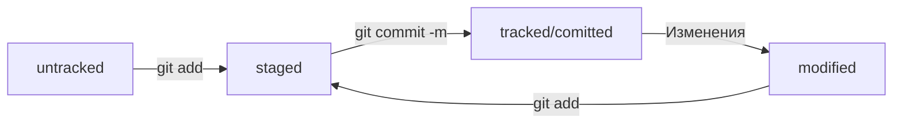

# Первые шаги в Git

## Разделы

1. Настройка окружения и знакомство с командной строкой
2. Начало работы с Git
 
## 1. Настройка окружения и знакомство с командной строкой

### Навигация
- pwd — показать рабочую папку;
- ls — покажи содержимое текущей текущей папки (-a — показать скрытые файлы);
- cd first-project перейти в папку first-project;
- cd .. — перейти на уровень выше, в родительскую папку;
- cd ~ — перейти в домашнюю директорию (/Users/Username);
- cd / — перейти в корневую директорию.

### Работа с файлами и папками
- touch index.html — создать файл index.html в текущей папке;
- mkdir second-project — создать папку с именем second-project в текущей папке;
- cp file.txt ~/my-dir  — скопировать файл в другое место;
- mv file.txt ~/my-dir  — переместить файл или папку в другое место;
- cat file.txt — распечатать содержимое текстового файла file.txt;
- rm about.html — удалить файл about.html;
- rmdir images — удалить папку images;
- rm -r second-project — удалить папку second-project и всё, что она содержит.

## 2. Начало работы с Git
### Работа с локальным репозитрием
- git init — инициализировать репозиторий;
- git status — проверить статус, или состояние репозитория;
- для удаления репозитория необходимо удалить скрытую подпапку .git;

---
- git add — подготовить файл к сохранению; git add --all подготовить к сохранению сразу все файлы;
git add .  — можно добавить в репозиторий текущую папку со всеми файлами;
- git commit — сделать коммит;
Ключ -m позволяет присвоить коммиту сообщение;
- git log — просмотреть историю коммитов.
### Работа с глобальным репозиторием
- git remote add — связать удалённый репозиторий с локальным
- git push -u origin main — загрузка на GitHub в первый раз;
- git push — загрузка на GitHub;
## 3. Навигация по коммитам
### Хеш
 Git преобразует информацию о коммитах с помощью алгоритма SHA-1 и для каждого из них рассчитывает уникальный идентификатор — хеш.
 
 
 Хеш — основной идентификатор коммита и позволяет узнать его автора, дату и содержимое закоммиченных файлов.
Все хеши, а также таблицу соответствий "хеш → информация о коммите" Git хранит в папке .git.
### Лог
Можно вызвать не только полный лог, но и сокращённый — это делается командой **git log --oneline**.

В сокращённом логе выводятся сокращённые хеши — их можно использовать точно так же, как и полные.

В числе прочих файлов в папке .git есть служебный файл **HEAD**. Он указывает на самый свежий коммит.
Вместо хеша последнего коммита можно написать слово **HEAD**.
### Статус
Статусом **untracked** помечается файл, о существовании которого Git знает, но не следит за изменениями в нём. Этот статус — противоположность **tracked**, в который попадают все файлы, отслеживаемые Git.

Файл переходит в статус **staged** после выполнения **git add**.
Статус **modified** означает, что файл был изменён.
Большинство файлов в проектах «шагает» по следующему циклу: «изменён» → «добавлен в список на коммит» → «закоммичен» → «изменён» → и так далее.

## 4. Работа над ошибками в коммитах
### Оформление сообщений к коммитам
В выводе команды **git log --oneline** умещается максимум 
**72** первых символа сообщения.

Для сообщений на русском языке часто рекомендуют использовать инфинитивы. Например: Добавить тесты для PipkaService.

Для сообщений на английском рекомендуется использовать повелительное наклонение (англ. imperative). Например: Use library mega_lib_300, Fix exit button.
- Корпоративное оформление
 
У каждой задачи в Jira есть идентификатор из нескольких заглавных латинских букв и номера. Например, LGS-239 значит, что это это 239-я задача в проекте LGS (сокращение от англ. logistics — «логистика»).
В корпоративном стиле в начале сообщения обычно указывают Jira-ID, а после — текст сообщения.

Пример: ```git commit -m "LGS-239: Дополнить список пасхалок новыми числами"``` 
- Conventional Commits

Conventional Commits предлагает такой формат коммита: <тип>: <сообщение>. Первая часть type — это тип изменений. Таких типов достаточно много.

Пример: ``` git commit -m "feat: добавить подсчёт суммы заказов за неделю" ```
- GitHub-стиль

GitHub можно использовать не только для хранения файлов проекта, но и для ведения списка задач (англ. issue) этого проекта. Если коммит «закрывает» или «решает» какую-то задачу, то в его сообщении удобно указывать ссылку на неё. Для этого в любом месте сообщения нужно указать #<номер задачи>.

Пример:``` git commit -m "Исправить #334, добавить график температуры" ```